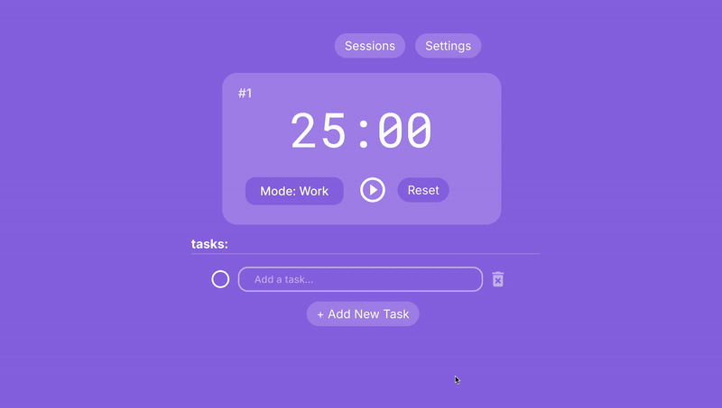

# Pomodoro Task App

A study app with the famous Pomodoro technique 

🪻 The Stack: 

* FrontEnd:
  - **Vite + React + TypeScript**
* Backend: 
  - **Express + Socket.IO** in the middle,
  - **Postgres (Neon) via Prisma** for data,
  - **Firebase Auth** for authentication

🪻 Live app: [https://mycutechat.netlify.app](https://mycutechat.netlify.app)  

## What it does

- Starts counting down work minutes once you start the timer
- User can change the set work minutes/break minutes and whether if they want the switch between work and break mode to be automatic 
- add/delete tasks
- keep track of tasks that are completed so user can see how many tasks they have completed in each task 

## Why I built it

I wanted a hands-on project to practice **react fundamentals**:  
- using react hooks such as useEffect for countdown,  
- context api to keep track of each session
- creating custom hooks
- experiment with custom components

